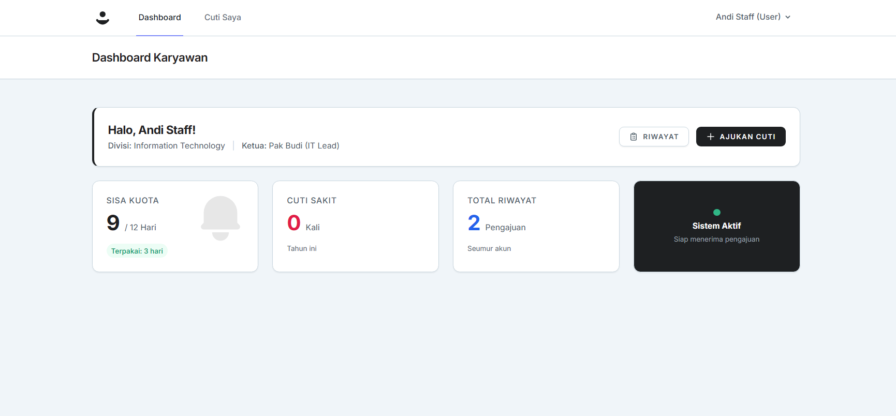
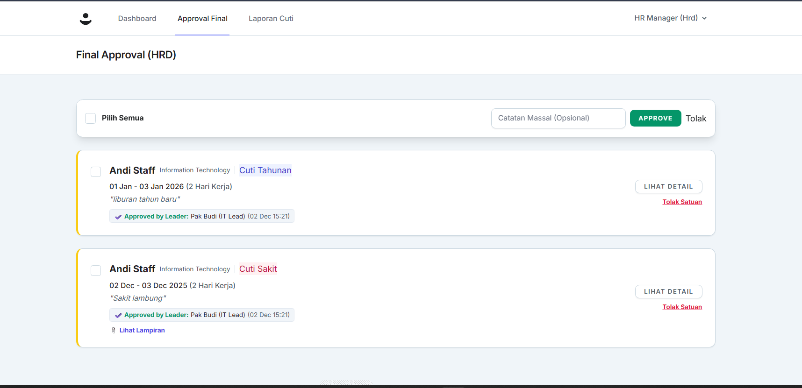

# Dokumentasi Sistem NakCuti


**NakCuti** adalah solusi manajemen sumber daya manusia yang difokuskan pada digitalisasi proses perizinan cuti. Dibangun dengan arsitektur MVC yang kokoh menggunakan Laravel, aplikasi ini menawarkan efisiensi alur kerja dari pengajuan hingga pelaporan.

[]()
[](LICENSE)
[](https://www.php.net/)

---

## 📑 Daftar Isi
- [Latar Belakang](#latar-belakang)
- [Arsitektur & Teknologi](#arsitektur--teknologi)
- [Fitur Utama](#fitur-utama)
- [Pratinjau Aplikasi](#pratinjau-aplikasi)
- [Panduan Instalasi](#panduan-instalasi)
- [Akses Demo](#akses-demo)

---

## Latar Belakang

Sistem ini dikembangkan untuk menjawab kebutuhan perusahaan akan sistem cuti yang transparan dan *paperless*. Berbeda dengan sistem konvensional, NakCuti mengimplementasikan logika validasi cerdas (Smart Validation) yang secara otomatis memperhitungkan hari libur nasional dan aturan H-3, serta mencegah tumpang tindih jadwal (overlapping).

Antarmuka pengguna didesain menggunakan pendekatan **"Nordic Slate UI"**, mengutamakan kenyamanan visual dan kemudahan navigasi untuk penggunaan jangka panjang.

---

## Arsitektur & Teknologi

Proyek ini dibangun di atas fondasi teknologi modern untuk menjamin performa dan skalabilitas:

| Komponen | Teknologi | Keterangan |
| :--- | :--- | :--- |
| **Framework** | Laravel 10 | Backend logic & routing |
| **Database** | MySQL 8.0 | Relational database management |
| **Styling** | Tailwind CSS | Utility-first CSS framework |
| **Interactivity** | Alpine.js | Lightweight JavaScript framework |
| **Template Engine** | Blade | Server-side rendering |
| **PDF Engine** | Laravel DomPDF | Generasi dokumen surat cuti |

---

## Fitur Utama

Sistem NakCuti dibagi menjadi modul-modul berdasarkan hak akses pengguna (Role-Based Access Control):

### 1. Modul Karyawan (User)
* **Dashboard Real-time:** Menampilkan sisa kuota cuti dan grafik riwayat.
* **Smart Form:** Validasi input otomatis (H-3 untuk cuti tahunan, Upload file untuk sakit).
* **Tracking Status:** Memantau posisi pengajuan (Menunggu / Disetujui Leader / Final HRD).

### 2. Modul Verifikator (Leader & HRD)
* **Approval Berjenjang:** Mekanisme persetujuan bertingkat (Leader -> HRD).
* **Bulk Action:** Fitur persetujuan massal untuk efisiensi waktu HRD.
* **Reporting:** Rekapitulasi data cuti seluruh karyawan dengan filter dinamis.

### 3. Modul Administrator
* **Master Data:** Manajemen User, Divisi, dan Struktur Organisasi.
* **Konfigurasi Libur:** Pengaturan hari libur nasional yang mempengaruhi perhitungan durasi cuti.

---

## Pratinjau Aplikasi

Berikut adalah tampilan antarmuka NakCuti dengan tema Nordic Slate.

### Tampilan Dashboard & Statistik
*Visualisasi data yang bersih memudahkan pengguna memantau hak cuti mereka.*


### Manajemen Approval (HRD)
*Antarmuka yang dirancang untuk produktivitas dengan fitur select-all dan validasi instan.*


---

## Panduan Instalasi

Pastikan komputer Anda telah terinstall **PHP**, **Composer**, dan **Node.js** sebelum memulai.

## 🚀 Instalasi

### 1️⃣ Clone Repository

```bash
git clone https://github.com/HA141User/Manajemen-Cuti.git
cd Manajemen-Cuti
```

---

### 2️⃣ Install Dependencies

**Install dependensi PHP**

```bash
composer install
```

**Install dependensi Node.js**

```bash
npm install
```

---

### 3️⃣ Setup Environment

**Salin file environment**

```bash
cp .env.example .env
```

**Generate application key**

```bash
php artisan key:generate
```

---

### 4️⃣ Konfigurasi Database

Edit file `.env` dan sesuaikan konfigurasi berikut:

```
DB_CONNECTION=mysql
DB_HOST=127.0.0.1
DB_PORT=3306
DB_DATABASE=cuti_final
DB_USERNAME=root
DB_PASSWORD=
```

---

### 5️⃣ Jalankan Migrasi dan Seeder

**Jalankan migrasi**

```bash
php artisan migrate
```

**Seed database dengan data dummy**

```bash
php artisan db:seed
```

---

### 6️⃣ Build Assets

**Development**

```bash
npm run dev
```

**Production**

```bash
npm run build
```

---

### 7️⃣ Jalankan Server

**Development server**

```bash
php artisan serve
```

**Terima kasih**
